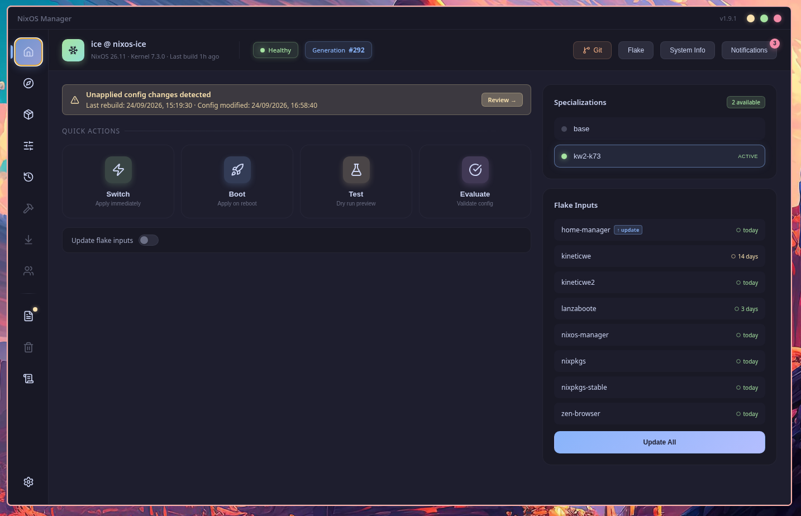
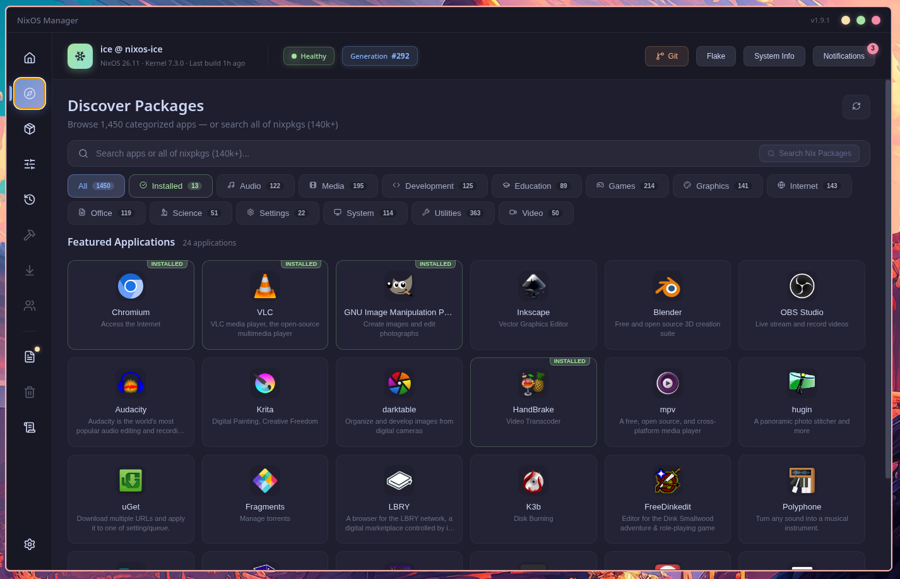
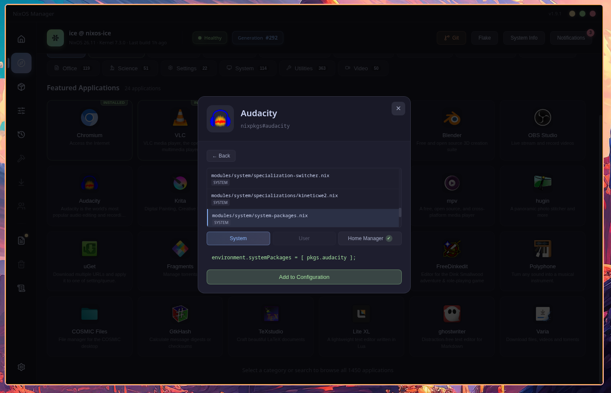
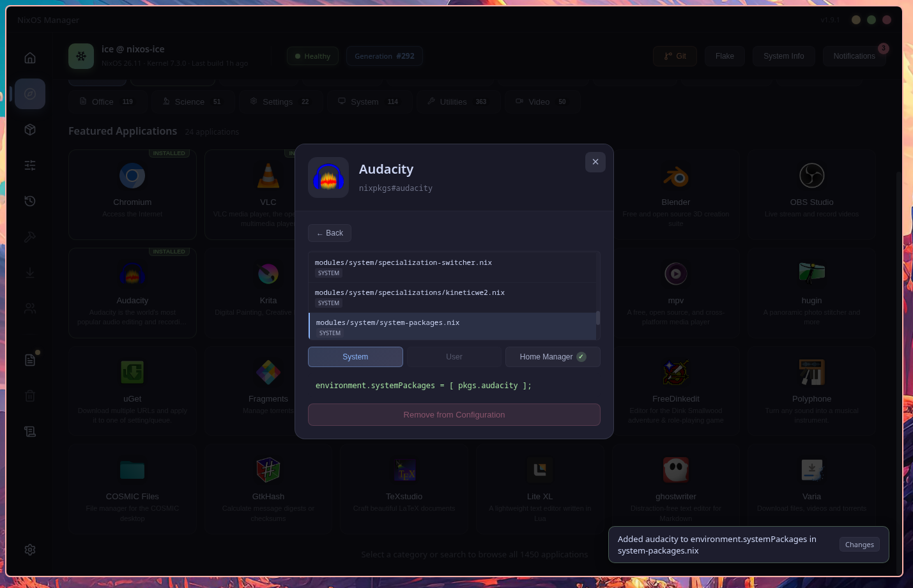
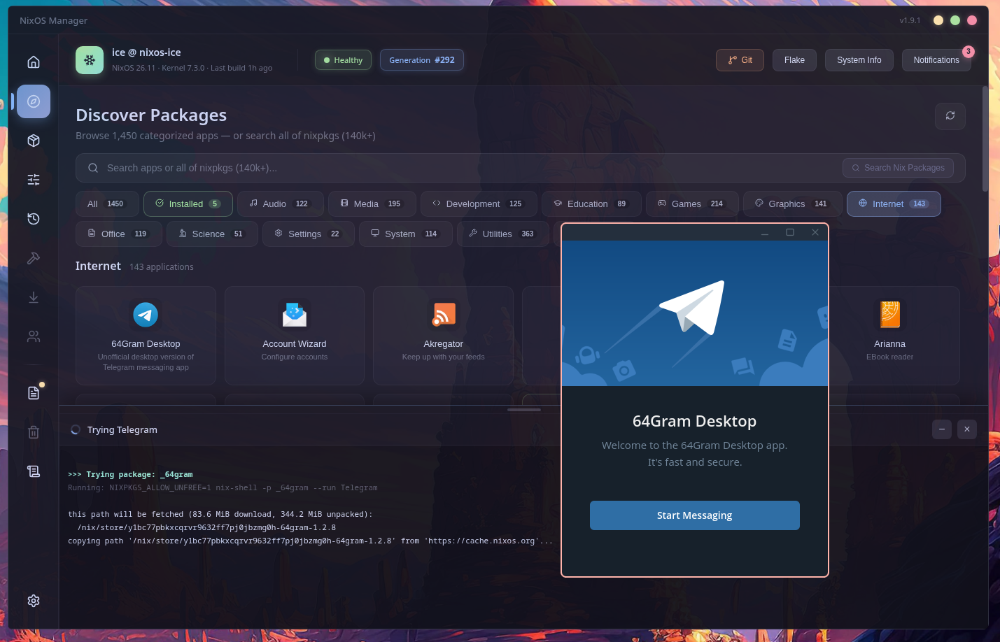

<div align="center">
  
  <h1>NixOS Manager</h1>
  <p>A beautiful desktop app for managing NixOS flake configurations.<br/>Built with Electron and Svelte 5, themed with Catppuccin Mocha.</p>

  [](https://github.com/icefirex/nixos-manager/releases)
  [](LICENSE)
  [](https://nixos.org)
  [](https://www.electronjs.org)
  [](https://svelte.dev)
  [](https://catppuccin.com)
</div>

---

<p align="center">
  
  
</p>
<p align="center">
  
  
</p>
<p align="center">
  
</p>

---

## Features

### System Rebuild
- **Switch** — Apply configuration changes immediately
- **Boot** — Build for next reboot
- **Test** — Dry-run preview without persisting
- **Evaluate** — Validate configuration without building
- Real-time build progress with step tracking and terminal output
- Optional flake input updates before rebuilding

### Package Discovery
- Browse thousands of applications from the AppStream catalog
- 13 categories (Development, Games, Graphics, Internet, etc.)
- Search across both AppStream and nixpkgs
- Try packages instantly with `nix-shell` before installing
- Package details: version, license, homepage, maintainers

### Installed Packages
- View packages from system config, user profile, and home-manager
- Toggle between config-defined and live system views
- Expand any package for metadata (version, license, binaries, source location)
- Links to NixOS Search and nixpkgs source

### NixOS Options
- Browse all options set in your configuration files
- Categories: services, programs, hardware, networking, boot, system
- Toggle between config-defined and live system views
- Nix syntax highlighting with Catppuccin colors
- Links to NixOS option search and declarations

### Generation Management
- List all system generations with diffs between them
- See added, removed, and changed packages per generation
- Search across all generations for specific package changes
- Switch to, boot into, or delete any generation
- View NixOS version, kernel, and closure size per generation

### Git Integration
- View repository status, branches, and recent commits
- Pull, fetch, and switch branches from the GUI
- Commit detail viewer with changed files and stats

### System Monitoring
- System health indicator in the header
- Notification center with actionable alerts (git sync status, stale flake inputs, disk space, generation count)
- Detailed system info: CPU, memory, disk, uptime, specialization

### Flake Management
- View all flake inputs with age indicators
- Update individual inputs or all at once
- Switch between specializations (multi-profile support)

## Requirements

- **NixOS** with flakes enabled
- A flake-based NixOS configuration repository
- `git` available in system PATH

### Flake Directory Detection

The app looks for your flake configuration in this order:

1. `$FLAKE_DIR` environment variable
2. `~/nixos-config`
3. `~/.config/nixos`
4. `/etc/nixos`

Set `FLAKE_DIR` if your configuration lives elsewhere.

### Build Tool Integration

The app resolves the rebuild command using the following priority chain:

| Priority | Command | When used |
|----------|---------|-----------|
| 1 | `$NIXOS_REBUILD_COMMAND` | Always, if set |
| 2 | `nixos-rebuild-wrapper` | If present on PATH |
| 3 | `nixos-manager-rebuild` | Bundled fallback (always available) |

The bundled `nixos-manager-rebuild` script uses `nh` if available, otherwise falls back to `nixos-rebuild`. The same priority chain applies to the Evaluate action (`$NIXOS_EVAL_COMMAND` → `nix-eval-flake` → bundled `nixos-manager-eval`).

## Installation

### NixOS Flake (recommended)

Add to your `flake.nix` inputs:

```nix
{
  inputs.nixos-manager.url = "github:icefirex/nixos-manager";
}
```

A more traditional way to add it to an existing `flake.nix`, ensuring your local `nixpkgs` is used instead of the one pinned by nixos-manager:

```nix
{
  inputs.nixos-manager = {
    url = "github:icefirex/nixos-manager";
    inputs.nixpkgs.follows = "nixpkgs";
  };
}
```

Then enable the NixOS module in your configuration:

```nix
{ inputs, pkgs, ... }:
{
  imports = [ inputs.nixos-manager.nixosModules.default ];

  programs.nixos-manager = {
    enable = true;
    package = inputs.nixos-manager.packages.${pkgs.system}.default;
  };
}
```

### Nix Build (standalone)

```bash
nix build github:icefirex/nixos-manager
./result/bin/nixos-manager
```

### Nix Run (try without installing)

```bash
nix run github:icefirex/nixos-manager
```

### Development

```bash
git clone https://github.com/icefirex/nixos-manager.git
cd nixos-manager
npm install
npm run dev
```

This starts both the Vite dev server and Electron with hot reload.

## Configuration

### Environment Variables

| Variable | Description |
|----------|-------------|
| `FLAKE_DIR` | Path to your flake-based NixOS configuration |
| `NIXOS_REBUILD_COMMAND` | Override the rebuild command (e.g. `my-custom-wrapper`) |
| `NIXOS_EVAL_COMMAND` | Override the evaluate command |
| `ELECTRON_IS_DEV` | Set to `1` for development mode (auto-opens DevTools) |

### Custom Rebuild Commands

Set `NIXOS_REBUILD_COMMAND` to use a fully custom rebuild script. The app passes `<action> <flake_path> [--update]` as arguments:

```bash
# In your shell profile or NixOS environment.sessionVariables:
export NIXOS_REBUILD_COMMAND="my-nixos-rebuild"
```

The bundled fallback script (`nixos-manager-rebuild`) is always present as a last resort. It uses `nh` when available and falls back to `nixos-rebuild --flake`.

## Tech Stack

- **Electron** — Desktop runtime
- **Svelte 5** — Reactive UI framework (runes mode)
- **Vite** — Build tool
- **Lucide** — SVG icon library
- **xterm.js** — Terminal emulator for build output
- **highlight.js** — Nix syntax highlighting
- **Catppuccin Mocha** — Color theme

## Architecture

```
src/
├── App.svelte                 # Root component, routing
├── lib/                       # UI components
│   ├── Dashboard.svelte       # Rebuild actions + progress
│   ├── Discover.svelte        # AppStream package browser
│   ├── Packages.svelte        # Installed package viewer
│   ├── Options.svelte         # NixOS options viewer
│   ├── Generations.svelte     # Generation management
│   ├── GitModal.svelte        # Git operations
│   ├── Sidebar.svelte         # Navigation
│   ├── HeaderStrip.svelte     # System status bar
│   └── ...                    # Supporting components
├── main/
│   ├── window.js              # Electron window setup
│   ├── utils.js               # Shared utilities
│   └── handlers/              # IPC handler modules
│       ├── system.js           # System info
│       ├── rebuild.js          # NixOS rebuild
│       ├── generations.js      # Generation management
│       ├── packages.js         # Package parsing
│       ├── options.js          # Option parsing
│       ├── discover.js         # AppStream integration
│       ├── git.js              # Git operations
│       ├── flake.js            # Flake input management
│       ├── specializations.js  # Profile switching
│       └── notifications.js    # System alerts
scripts/
│   ├── nixos-manager-rebuild  # Bundled generic rebuild fallback
│   └── nixos-manager-eval     # Bundled generic eval fallback
```

All renderer-to-main communication goes through a secure IPC bridge (`preload.js`) with context isolation enabled.

## Building

```bash
# Build the Svelte frontend only
npm run build:svelte

# Build with Nix (produces a wrapped Electron binary)
nix build .
```

## Contributing

See [CONTRIBUTING.md](CONTRIBUTING.md).

## License

MIT — see [LICENSE](LICENSE).
