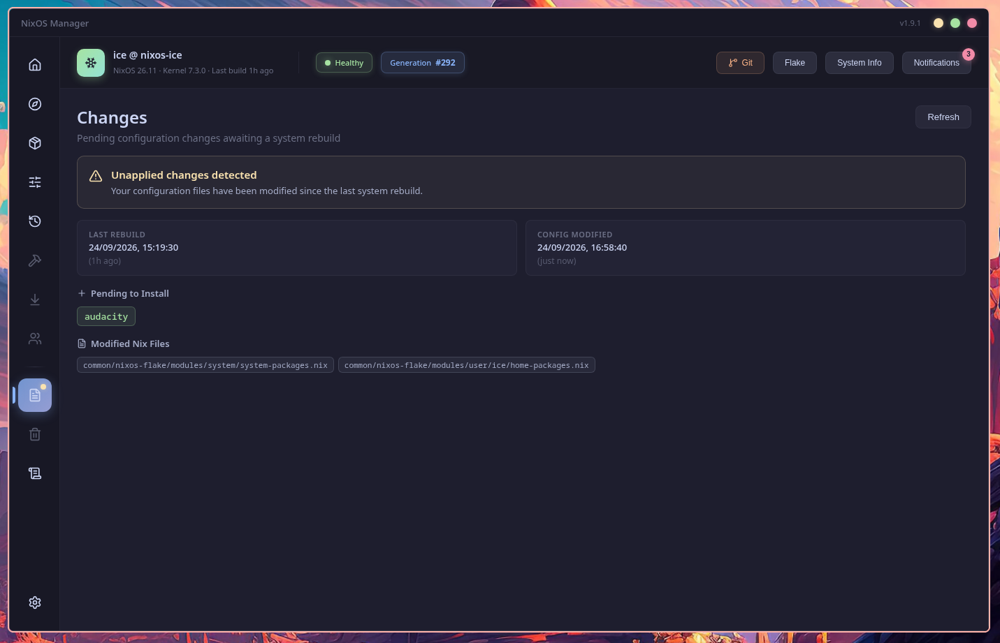
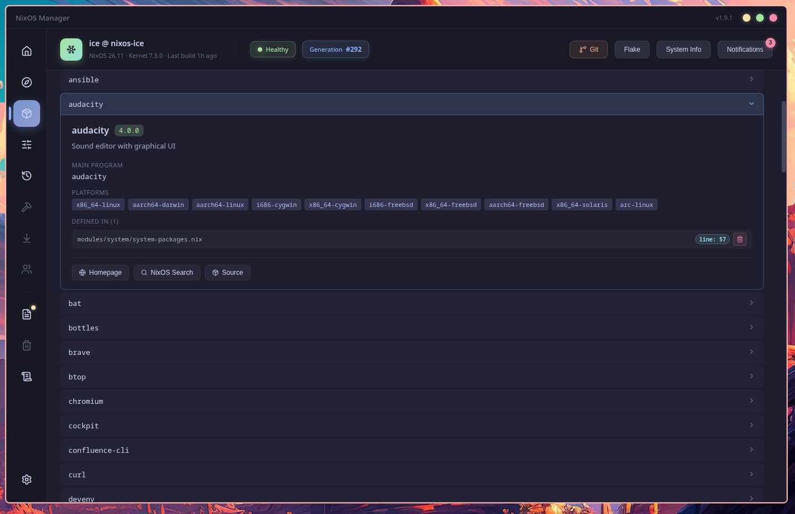
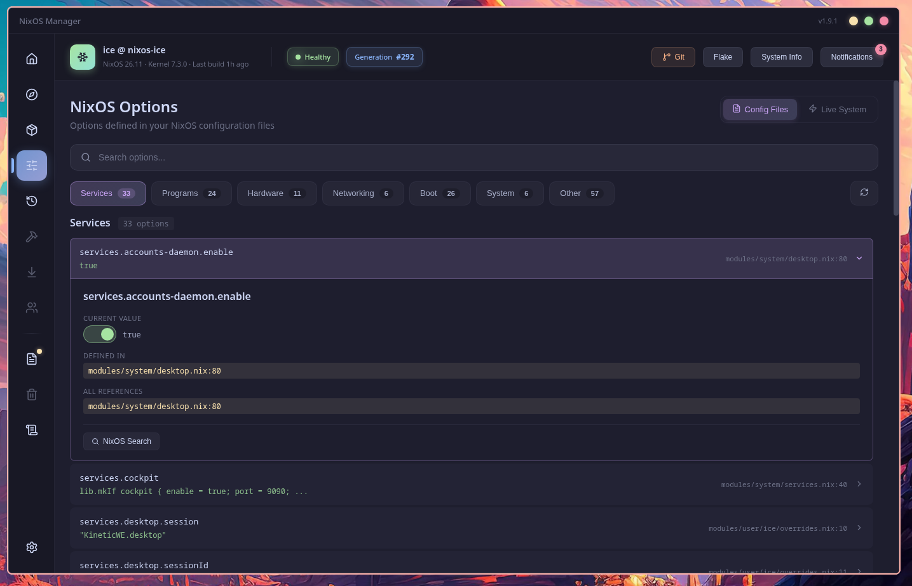
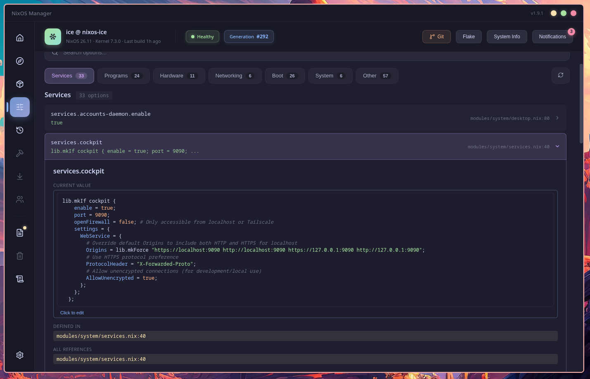
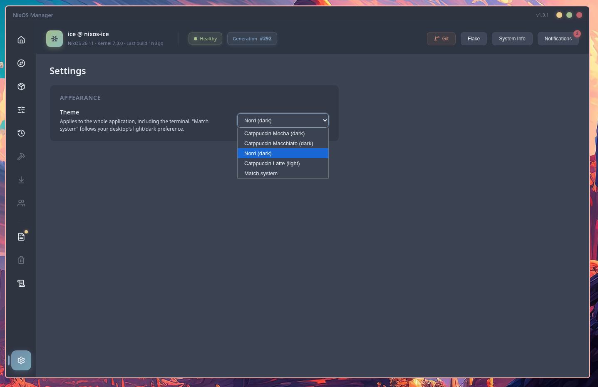
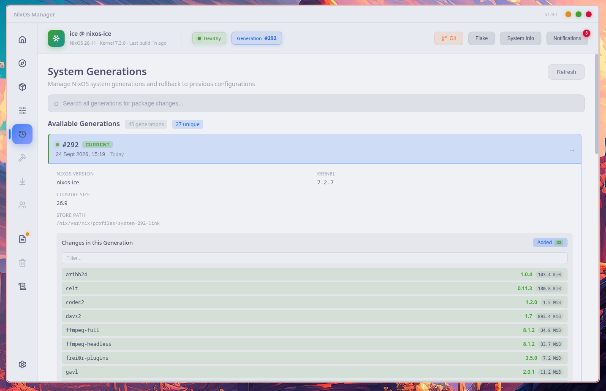
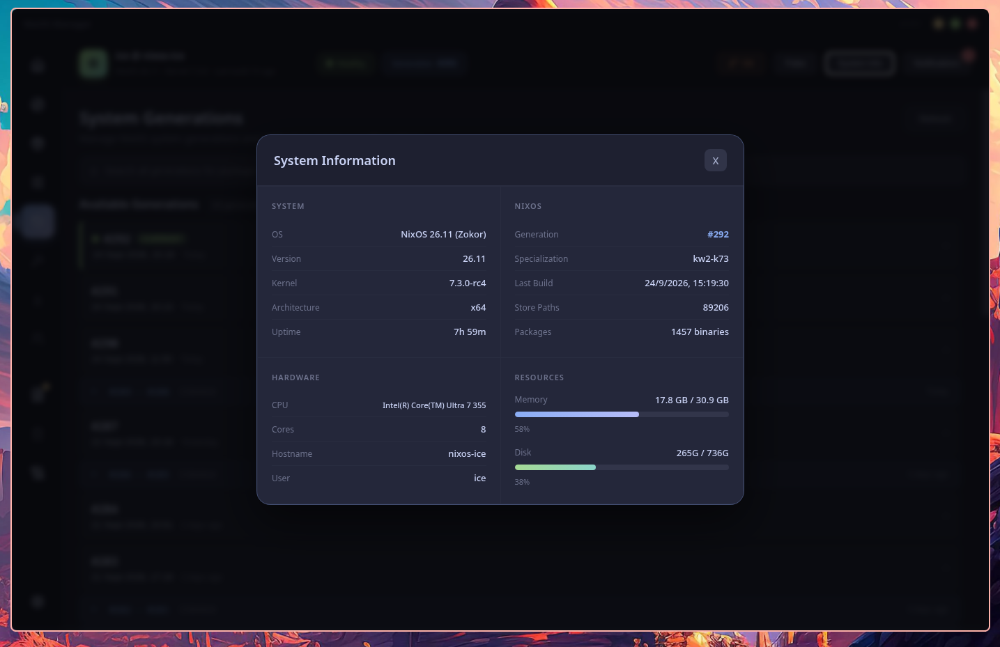

<div align="center">
  
  <h1>NixOS Manager</h1>
  <p>A beautiful desktop app for managing NixOS flake configurations.<br/>Built with Electron and Svelte 5, fully TypeScript, themed with Catppuccin & Nord.</p>

  [](https://github.com/icefirex/nixos-manager/releases)
  [](LICENSE)
  [](https://nixos.org)
  [](https://www.electronjs.org)
  [](https://svelte.dev)
  [](https://catppuccin.com)
  [](https://www.typescriptlang.org)
</div>

---

<p align="center">
  
  
</p>
<p align="center">
  
  
</p>
<p align="center">
  
  
</p>
<p align="center">
  
  
</p>
<p align="center">
  
  
</p>
<p align="center">
  
  
</p>

---

## Features

### System Rebuild
- **Switch** — Apply configuration changes immediately
- **Boot** — Build for next reboot
- **Test** — Dry-run preview without persisting
- **Evaluate** — Validate configuration without building
- Real-time build progress with step tracking and terminal output
- Optional flake input updates before rebuilding

### Package Discovery
- Browse thousands of applications from the AppStream catalog
- 13 categories (Development, Games, Graphics, Internet, etc.)
- Search across both AppStream and nixpkgs
- Try packages instantly with `nix-shell` before installing
- Package details: version, license, homepage, maintainers

### Installed Packages
- View packages from system config, user profile, and home-manager
- Toggle between config-defined and live system views
- Cross-file duplicate detection with consolidation suggestions
- Not-in-config panel for transitive dependencies
- Auto-selection when search narrows to one result
- Expand any package for metadata (version, license, binaries, source location)
- Links to NixOS Search and nixpkgs source

### NixOS Options
- Browse all options set in your configuration files
- Categories: services, programs, hardware, networking, boot, system
- Toggle between config-defined and live system views
- Nix syntax highlighting with Catppuccin colors
- Links to NixOS option search and declarations

### Generation Management
- List all system generations with diffs between them
- See added, removed, and changed packages per generation
- Visual treatment for version changes (strikethrough old, green new, size badge)
- Search across all generations for specific package changes
- Switch to, boot into, or delete any generation
- View NixOS version, kernel, and closure size per generation

### Git Integration
- View repository status, branches, and recent commits
- Pull, fetch, and switch branches from the GUI
- Commit detail viewer with changed files and stats

### System Monitoring
- System health indicator in the header
- Notification center with actionable alerts (git sync status, stale flake inputs, disk space, generation count)
- Detailed system info: CPU, memory, disk, uptime, specialization

### Config Editing
- Edit option values inline — toggles for booleans, syntax-highlighted multi-line editor for complex values
- Add packages to your configuration from Discover (system, user, or home-manager targets)
- Remove packages from any config file with automatic diff feedback
- Revert individual option changes from git

### Theming
- 4 built-in themes: Catppuccin Mocha, Macchiato, Nord, Latte — plus Match-system
- Applies to the whole app, including the embedded terminal (live re-theming)
- Persisted across restarts, no boot flash (native window background follows the theme)
- All colors tokenized as CSS custom properties — new themes are one token block

### Flake Management
- View all flake inputs with age indicators
- Update individual inputs or all at once
- Switch between specializations (multi-profile support)

### Config Drift Detection
- See which config files have been modified since last rebuild
- View pending packages that were added or removed through the app
- Timestamp comparison between rebuild and config modification

## Requirements

- **NixOS** with flakes enabled
- A flake-based NixOS configuration repository
- `git` available in system PATH

### Flake Directory Detection

The app looks for your flake configuration in this order:

1. `$FLAKE_DIR` environment variable
2. `~/nixos-config`
3. `~/.config/nixos`
4. `/etc/nixos`

Set `FLAKE_DIR` if your configuration lives elsewhere.

### Build Tool Integration

The app resolves the rebuild command using the following priority chain:

| Priority | Command | When used |
|----------|---------|-----------|
| 1 | `$NIXOS_REBUILD_COMMAND` | Always, if set |
| 2 | `nixos-rebuild-wrapper` | If present on PATH |
| 3 | `nixos-manager-rebuild` | Bundled fallback (always available) |

The bundled `nixos-manager-rebuild` script uses `nh` if available, otherwise falls back to `nixos-rebuild`. The same priority chain applies to the Evaluate action (`$NIXOS_EVAL_COMMAND` → `nix-eval-flake` → bundled `nixos-manager-eval`).

## Installation

### NixOS Flake (recommended)

Add to your `flake.nix` inputs:

```nix
{
  inputs.nixos-manager.url = "github:icefirex/nixos-manager";
}
```

A more traditional way to add it to an existing `flake.nix`, ensuring your local `nixpkgs` is used instead of the one pinned by nixos-manager:

```nix
{
  inputs.nixos-manager = {
    url = "github:icefirex/nixos-manager";
    inputs.nixpkgs.follows = "nixpkgs";
  };
}
```

Then enable the NixOS module in your configuration:

```nix
{ inputs, pkgs, ... }:
{
  imports = [ inputs.nixos-manager.nixosModules.default ];

  programs.nixos-manager = {
    enable = true;
    package = inputs.nixos-manager.packages.${pkgs.stdenv.hostPlatform.system}.default;
  };

  environment.variables = {
    FLAKE_DIR = "/path/to/your/nixos-config";
  };
}
```

If your flake isn't at one of the [auto-detected locations](#flake-directory-detection), set `FLAKE_DIR` to point the app at it.

### Nix Build (standalone)

```bash
nix build github:icefirex/nixos-manager
./result/bin/nixos-manager
```

### Nix Run (try without installing)

```bash
nix run github:icefirex/nixos-manager
```

### Binary Cache (Cachix)

Pre-built binaries are available via [Cachix](https://cachix.org). Add to your `flake.nix` or `configuration.nix`:

```nix
nix.settings.trusted-substituters = [ "https://nixos-manager-icefire.cachix.org" ];
nix.settings.trusted-public-keys = [ "nixos-manager-icefire.cachix.org-1:eUCn5EOD2Y8bKQpGbFEAfQc8TxOjQ+te/n3up5A4LOA=" ];
```

### Development

```bash
git clone https://github.com/icefirex/nixos-manager.git
cd nixos-manager
nix-shell                # dev shell — Node 24 + Electron
npm install
npm run dev
```

`npm run dev` builds the main process (`build:main`), starts the Vite dev server, and launches Electron with the renderer on hot reload.

**After changing main-process code** (`src/main/**`, `preload.ts`), re-run `npm run build:main` and restart Electron — the renderer hot-reloads, but Electron runs the compiled output.

### Checks

```bash
npm test                 # 314 vitest tests
npm run typecheck        # strict tsc (sources, types, tests)
npm run check            # svelte-check — expected: 0 errors, 0 warnings
```

CI runs all three on every PR and is a required check on `main` (squash/rebase merges only).

## Testing

Tests use [Vitest](https://vitest.dev) and live next to the code they cover — **314 tests** across the main process and the renderer.

```
src/
├── lib/                          # Renderer tests (jsdom + Testing Library)
│   ├── themes.test.ts            # 14 tests — theme store, persistence, palettes
│   ├── Settings.test.ts          # 4 tests — theme picker applies + persists
│   ├── Sidebar.test.ts           # 5 tests — navigation
│   ├── Icon.test.ts              # 3 tests
│   └── ActionCard.test.ts        # 3 tests
├── main/
│   ├── constants.test.ts         # 3 tests — all exports and thresholds
│   ├── parse.test.ts             # 36 tests — nix code parser
│   ├── nix-packages.test.ts      # 65 tests — package scanner
│   ├── utils.test.ts             # 10 tests — flake dir detection, runCmd, spawn env
│   └── handlers/
│       ├── discover.test.ts      # 33 tests
│       ├── options.test.ts       # 20 tests
│       ├── specializations.test.ts  # 18 tests
│       ├── flake.test.ts         # 16 tests
│       ├── git.test.ts           # 15 tests
│       ├── generations.test.ts   # 15 tests
│       ├── packages.test.ts      # 13 tests
│       ├── notifications.test.ts # 13 tests
│       ├── system.test.ts        # 12 tests
│       ├── rebuild.test.ts       # 8 tests
│       └── history.test.ts       # 8 tests
tests/
└── mocks/
    └── electron.ts               # IPC mock — no Electron binary needed
```

### Running

```bash
nix-shell                # dev shell — Node 24 (>= 23.6 required for .ts sources)

npm test                 # all 314 tests
npm run typecheck        # strict tsc over sources, types, and tests
npm run check            # svelte-check (expected: 0 errors, 0 warnings)
npm run test -- --coverage
```

### Coverage

Overall **70.5%** statements. Core modules (constants, parse, utils, nix-packages) sit at 70–100%, handlers between 59–96%, and the theme store at 97.6%. Every IPC handler is a DI-lite factory (see [`docs/di-lite-handlers.md`](docs/di-lite-handlers.md)), so side-effecting dependencies (`runCmd`, `spawn`, `fs`, `getDb`) are injected and stubbed per test — no Electron binary required. CI runs the full suite (typecheck + svelte-check + tests) on every PR and is a required check on `main`.

## Configuration

### Environment Variables

| Variable | Description |
|----------|-------------|
| `FLAKE_DIR` | Path to your flake-based NixOS configuration |
| `NIXOS_REBUILD_COMMAND` | Override the rebuild command (e.g. `my-custom-wrapper`) |
| `NIXOS_EVAL_COMMAND` | Override the evaluate command |
| `ELECTRON_IS_DEV` | Set to `1` for development mode (auto-opens DevTools) |

### Custom Rebuild Commands

Set `NIXOS_REBUILD_COMMAND` to use a fully custom rebuild script. The app passes `<action> <flake_path> [--update]` as arguments:

```bash
# In your shell profile or NixOS environment.sessionVariables:
export NIXOS_REBUILD_COMMAND="my-nixos-rebuild"
```

The bundled fallback script (`nixos-manager-rebuild`) is always present as a last resort. It uses `nh` when available and falls back to `nixos-rebuild --flake`.

## Tech Stack

- **Electron** — Desktop runtime
- **TypeScript** — 100% of the codebase, strict mode (`noImplicitAny`)
- **Svelte 5** — Reactive UI framework (runes mode, `lang="ts"` components)
- **Vite** — Build tool (renderer + config bundling)
- **svelte-check + tsc** — Type checking, enforced in CI
- **Vitest** — Test runner with v8 coverage (+ jsdom & Testing Library for the renderer)
- **Lucide** — SVG icon library
- **xterm.js** — Terminal emulator for build output
- **highlight.js** — Nix syntax highlighting
- **Catppuccin & Nord** — Built-in themes (token-based CSS custom properties)

## Architecture

```
main.ts / preload.ts            # Electron entry + secure IPC bridge (compiled to dist-electron/)
src/
├── App.svelte                  # Root component, tab routing
├── main.ts                     # Renderer entry (Vite)
├── styles.css                  # Theme tokens (:root) + base styles
├── lib/                        # Svelte 5 components — all lang="ts"
│   ├── Dashboard  Discover  Packages  Options  Generations
│   ├── History  Changes  Settings  Sidebar  HeaderStrip
│   ├── Terminal  TerminalOverlay  GitModal  SystemInfoModal
│   ├── NotificationsModal  FlakeInfoModal  ActionCard  ProgressCard  Icon
│   ├── themes.ts               # Theme store: persistence, events, xterm palettes
│   └── a11y.ts                 # Keyboard-activation helper
├── main/                       # Main process (compiled via tsconfig.build.json)
│   ├── constants.ts  parse.ts  utils.ts  nix-packages.ts  window.ts
│   └── handlers/               # 11 IPC modules — DI-lite factories
│       ├── system.ts      notifications.ts   rebuild.ts    specializations.ts
│       ├── flake.ts       packages.ts        options.ts    generations.ts
│       ├── git.ts         discover.ts        history.ts
tests/mocks/electron.ts         # IPC mock for tests
scripts/
├── nixos-manager-rebuild       # Bundled rebuild fallback (uses nh when available)
└── nixos-manager-eval          # Bundled eval fallback
```

All renderer-to-main communication goes through a secure IPC bridge (`preload.ts`, compiled to `dist-electron/preload.js`) with context isolation enabled.

## Building

```bash
npm run build:main       # compile main process + preload -> dist-electron/
npm run build:svelte     # build the Svelte frontend -> dist/
nix build .              # full Nix package (wrapped system Electron binary)
```

## Contributing

See [CONTRIBUTING.md](CONTRIBUTING.md).

## License

MIT — see [LICENSE](LICENSE).
